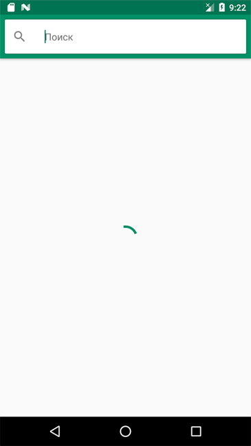
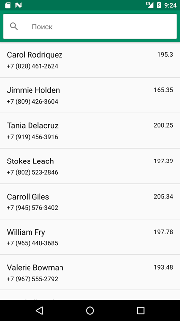
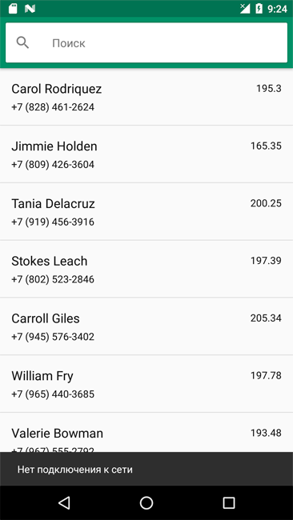
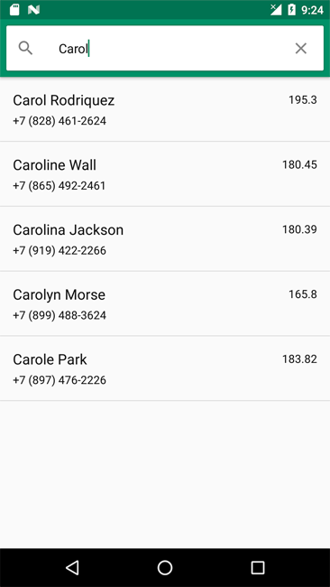
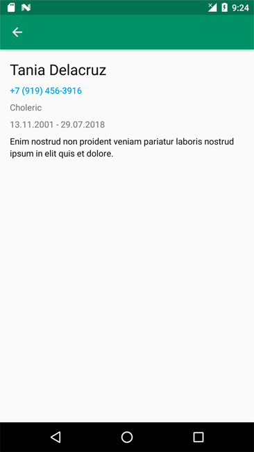

# Задача
Написать мобильное приложение, которое отображает список контактов и выполняет поиск по ним. Здорово, если приложение будет написано на Kotlin с использованием MV* (MVI, MVP, MVVM) подхода. Будет ли приложение на View или Compose, выбор остается за вами. Решенное задание выложить на GitHub/GitLab, код в архиве приниматься не будет.

# Описание
На старте приложение получает массив контактов из нескольких источников: [источник1](json/generated-01.json), [источник2](json/generated-02.json), [источник3](json/generated-03.json) и сохраняет их локально. Для получения прямой ссылки на json нажать "View Raw" при просмотре.  
В процессе загрузки контактов на экране отображается круговой ProgressBar:

 

Контакт человека имеет следующий вид
- id (string) — ID контакта
- name (string) — Имя человека
- height (float) — Рост человека
- biography (string) — Биография человека
- temperament (enum) — Темперамент человека (melancholic, phlegmatic, sanguine, choleric)
- educationPeriod (object) — Период прохождения учебы. Состоит из дат start и end.

Если приложение запускается не в первый раз, и с момента прошлой загрузки данных прошло более 1 минуты, то данные необходимо загрузить заново, иначе нужно показать данные, сохраненные локально.

Список контактов можно обновить свайпом вниз. Если при загрузке или обновлении данных происходит ошибка, то нужно показать ее с помощью Snackbar.

Поиск среди контактов происходит по имени или номеру телефона. Результаты поиска появляются по мере ввода символов в строку поиска и могут отображаться в основном списке. При клике на контакт открывается экран с более подробной информацией. Клик по номеру телефона открывает стандартный набор номера.

 

# Цвета интерфейса

- colorPrimary — #4c9069
- colorPrimaryDark — #3d7254
- colorAccent — #4d8f69
- Черный текст — #e5000000
- Серый текст — #8a000000
- Кликабельный текст — #269df7
